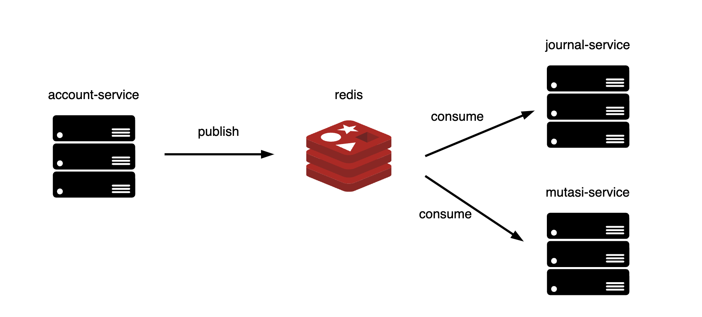

# REST API Bank dengan gofiber

Repository ini adalah sebuah REST API sistem bank simpel yang dibuat dengan menggunakan Golang.

## Dependencies

- Golang 1.22
- Docker
- Docker compose

## API Spec

| ROUTE                 | HTTP METHOD | REQUEST PAYLOAD                                                                          | RESPONSE                                                                                                     |
| --------------------- | ----------- | ---------------------------------------------------------------------------------------- | ------------------------------------------------------------------------------------------------------------ |
| /daftar               | POST        | { "nama": string, "nik": string, "no_hp": string, "pin": string, "kode_cabang": string } | { "code": int, "status": string, "remark": string, "data": { "no_rekening": string, "no_nasabah": string } } |
| /login                | POST        | { "no_nasabah": string, "pin": string }                                                  | { "code": int, "status": string, "remark": string, "data": { "token": string } }                             |
| /tabung               | POST        | { "no_rekening": string, "nominal": integer }                                            | { "code": int, "status": string, "remark": string, "data": { "saldo": float64 } }                            |
| /tarik                | POST        | { "no_rekening": string, "nominal": integer }                                            | { "code": int, "status": string, "remark": string, "data": { "saldo": float64 } }                            |
| /saldo/{no_rekening}  | GET         |                                                                                          | { "success": string, "data": { "saldo": integer } }                                                          |
| /mutasi/{no_rekening} | GET         |                                                                                          | { "success": string, "data": { "data": array } }                                                             |

## Rancangan sistem

## Rancangan database

desain database menggunakan drawsql.app

[account-service](https://drawsql.app/teams/rh142/diagrams/isi-backend-assessment)  

[journal-service](https://drawsql.app/teams/rh142/diagrams/isi-backend-assessment-journal-service)  

## Cara penggunaan

### 1. Clone repository

### 2. Buat file .env file di dalam masing-masing folder service

buat file `config.env` dan `pg-docker.env` yang akan menyimpan environment variabel pada masing-masing root service folder (dapat dilihat pada file env.sample)

buat file `redis.env` pada root folder (dapat dilihat pada `redis.env.sample`)

### 3. Buka terminal dan pindah ke project folder

### 4. Jalankan docker compose up

buka terminal dan jalankan `docker compose up`

### 5. Test the API
